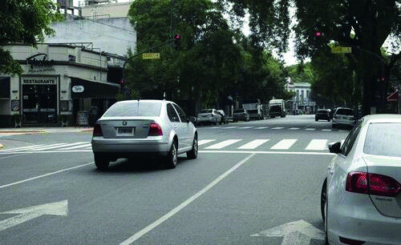

========== Question ==========  

### Durante esta situación, ¿es riesgoso que el conductor utilice el teléfono celular?



A. No, ya que no hay otros vehículos junto a él.

B. Sí, ya que a pesar de estar detenido, está en la vía de circulación y su atención no está dirigida al contexto.

C. No, ya que el vehículo no está en movimiento.  

========== Answer ==========  

B. Sí, ya que a pesar de estar detenido, está en la vía de circulación y su atención no está dirigida al contexto.

========== Id ==========  
115

---

DECK INFO

TARGET DECK: Licencia::Preguntas::MLDCB - Licencia de conducir buenos aires - multi author::Part I - Introduccion::Chapter 1 - Bateria de preguntas

FILE TAGS: #Licencia::#MLDCB-Licencia-de-conducir-buenos-aires-multi-author::#Part-I-Introduccion::#Chapter-1-Bateria-de-preguntas::#115-Durante-esta-situaci-n-es-riesgoso-que-e

Tags:

Reference:

Related:

```dataview
LIST
where file.name = this.file.name
```

QUESTION STATUS: Safe to store
