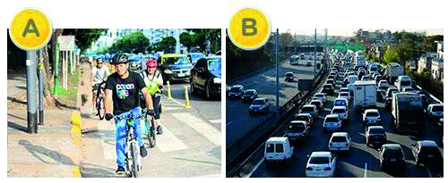

========== Question ==========  

### Indique cuál de las siguientes situaciones conlleva mayor probabilidad de siniestralidad



A. Opción A.

B. Opción B.

C. Ambas respuestas, A y B, son correctas.  

========== Answer ==========  

B. Opción B.

========== Id ==========  
13

---

DECK INFO

TARGET DECK: Licencia::Preguntas::MLDCB - Licencia de conducir buenos aires - multi author::Part I - Introduccion::Chapter 1 - Bateria de preguntas

FILE TAGS: #Licencia::#MLDCB-Licencia-de-conducir-buenos-aires-multi-author::#Part-I-Introduccion::#Chapter-1-Bateria-de-preguntas::#13-Indique-cu-l-de-las-siguientes-situaciones

Tags:

Reference:

Related:

```dataview
LIST
where file.name = this.file.name
```

QUESTION STATUS: Safe to store
