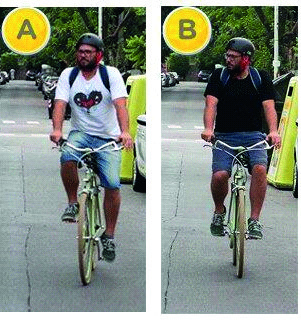

========== Question ==========  

### En cuanto a su indumentaria, ¿cuál de los dos ciclistas presenta menor riesgo de sufrir un siniestro vial?



A. La opción A, ya que al tener ropa clara es más visible.

B. Opción B, ya que al tener ropa oscura no genera distracciones en los demás conductores.

C. Ambas opciones presentan el mismo riesgo por igual.  

========== Answer ==========  

A. La opción A, ya que al tener ropa clara es más visible.

========== Id ==========  
27

---

DECK INFO

TARGET DECK: Licencia::Preguntas::MLDCB - Licencia de conducir buenos aires - multi author::Part I - Introduccion::Chapter 1 - Bateria de preguntas

FILE TAGS: #Licencia::#MLDCB-Licencia-de-conducir-buenos-aires-multi-author::#Part-I-Introduccion::#Chapter-1-Bateria-de-preguntas::#27-En-cuanto-a-su-indumentaria-cu-l-de-los

Tags:

Reference:

Related:

```dataview
LIST
where file.name = this.file.name
```

QUESTION STATUS: Safe to store
