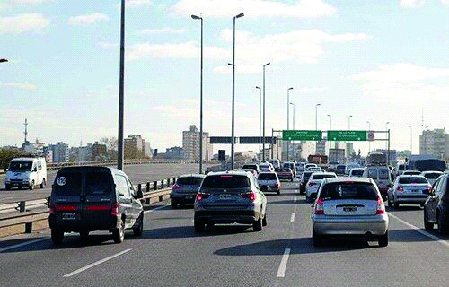

========== Question ==========  

### ¿Se puede circular en bicicleta por esta vía?



A. Sí, siempre que se mantenga en el carril derecho.

B. No, está prohibido.

C. Sí, mientras se respete la velocidad mínima de la arteria.  

========== Answer ==========  

B. No, está prohibido.

========== Id ==========  
28

---

DECK INFO

TARGET DECK: Licencia::Preguntas::MLDCB - Licencia de conducir buenos aires - multi author::Part I - Introduccion::Chapter 1 - Bateria de preguntas

FILE TAGS: #Licencia::#MLDCB-Licencia-de-conducir-buenos-aires-multi-author::#Part-I-Introduccion::#Chapter-1-Bateria-de-preguntas::#28-Se-puede-circular-en-bicicleta-por-esta-v

Tags:

Reference:

Related:

```dataview
LIST
where file.name = this.file.name
```

QUESTION STATUS: Safe to store
