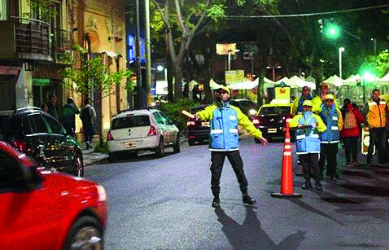

========== Question ==========  

### Que indica el señalamiento vertical de color azul A – Restricción B - información C – Prevención Que indica el señalamiento vertical con una orla roja A – Restricción B - información C – Prevención Que indica el señalamiento vertical de color amarillo A – Restricción B - información C – Prevención ¿Qué está indicando el agente de tránsito al realizar esta señal a un conductor?



A. Que circule con precaución.

B. Que detenga el vehículo.

C. Que continúe avanzando.  

========== Answer ==========  

B. Que detenga el vehículo.

========== Id ==========  
314

---

DECK INFO

TARGET DECK: Licencia::Preguntas::MLDCB - Licencia de conducir buenos aires - multi author::Part I - Introduccion::Chapter 1 - Bateria de preguntas

FILE TAGS: #Licencia::#MLDCB-Licencia-de-conducir-buenos-aires-multi-author::#Part-I-Introduccion::#Chapter-1-Bateria-de-preguntas::#314-Que-indica-el-se-alamiento-vertical-de-col

Tags:

Reference:

Related:

```dataview
LIST
where file.name = this.file.name
```

QUESTION STATUS: Safe to store
