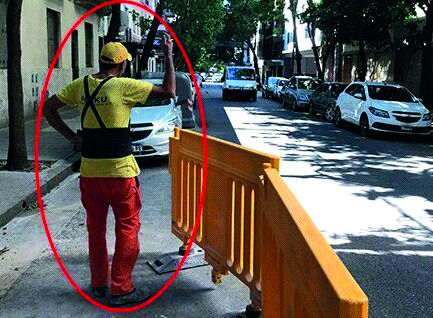

========== Question ==========  

### Si al circular por una vía y la persona señalada le indica detenerse, ¿está obligado usted a obedecer?



A. Sí, porque al ser personal de obra está autorizado a regular el paso de vehículos en el tramo donde están trabajando.

B. Sólo si se percibe una situación riesgosa ya que el personal de obra no tiene la autoridad legal para realizar dicha indicación.

C. No, porque no tiene autoridad ya que la Ley sólo delega dicha función a los agentes de tránsito.  

========== Answer ==========  

A. Sí, porque al ser personal de obra está autorizado a regular el paso de vehículos en el tramo donde están trabajando.

========== Id ==========  
316

---

DECK INFO

TARGET DECK: Licencia::Preguntas::MLDCB - Licencia de conducir buenos aires - multi author::Part I - Introduccion::Chapter 1 - Bateria de preguntas

FILE TAGS: #Licencia::#MLDCB-Licencia-de-conducir-buenos-aires-multi-author::#Part-I-Introduccion::#Chapter-1-Bateria-de-preguntas::#316-Si-al-circular-por-una-v-a-y-la-persona-se

Tags:

Reference:

Related:

```dataview
LIST
where file.name = this.file.name
```

QUESTION STATUS: Safe to store
