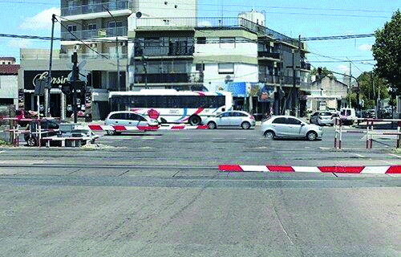

========== Question ==========  

### Si se encuentra en esta situación y el personal ferroviario le indica que avance, ¿qué debe hacer?



A. Avanzar porque el personal ferroviario está autorizado a regular el paso de vehículos.

B. Detenerme y esperar hasta que la barrera se levante porque el personal ferroviario no tiene la autoridad legal para realizar dicha indicación.

C. Detenerme y esperar hasta que la barrera se levante, salvo que la indicación sea realizada por un agente de tránsito ya que es la única autoridad competente.  

========== Answer ==========  

A. Avanzar porque el personal ferroviario está autorizado a regular el paso de vehículos.

========== Id ==========  
317

---

DECK INFO

TARGET DECK: Licencia::Preguntas::MLDCB - Licencia de conducir buenos aires - multi author::Part I - Introduccion::Chapter 1 - Bateria de preguntas

FILE TAGS: #Licencia::#MLDCB-Licencia-de-conducir-buenos-aires-multi-author::#Part-I-Introduccion::#Chapter-1-Bateria-de-preguntas::#317-Si-se-encuentra-en-esta-situaci-n-y-el-per

Tags:

Reference:

Related:

```dataview
LIST
where file.name = this.file.name
```

QUESTION STATUS: Safe to store
