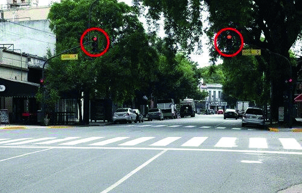

========== Question ==========  

### Si al conducir un vehículo se encuentra en una intersección con esta señalización intermitente, ¿qué actitud debe tomar?



A. Detener la marcha y realizar el cruce cuando se tenga la certeza de que no existe riesgo alguno.

B. Al tener prioridad, debo atravesarla rápidamente para no obstaculizar la vía.

C. Extremar precauciones al cruzar sin la necesidad de detenerme.  

========== Answer ==========  

A. Detener la marcha y realizar el cruce cuando se tenga la certeza de que no existe riesgo alguno.

========== Id ==========  
323

---

DECK INFO

TARGET DECK: Licencia::Preguntas::MLDCB - Licencia de conducir buenos aires - multi author::Part I - Introduccion::Chapter 1 - Bateria de preguntas

FILE TAGS: #Licencia::#MLDCB-Licencia-de-conducir-buenos-aires-multi-author::#Part-I-Introduccion::#Chapter-1-Bateria-de-preguntas::#323-Si-al-conducir-un-veh-culo-se-encuentra-en

Tags:

Reference:

Related:

```dataview
LIST
where file.name = this.file.name
```

QUESTION STATUS: Safe to store
