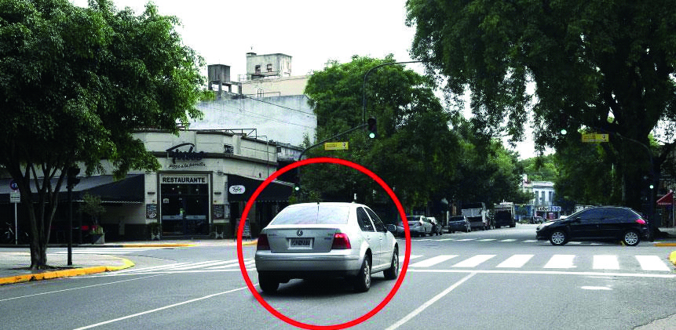

========== Question ==========  

### Frente a esta situación, ¿qué debe hacer el conductor del vehículo señalado con el círculo rojo?



A. Avanzar si es que el vehículo que cruza lo hace lentamente porque la prioridad de paso está dada por la luz verde.

B. No iniciar el cruce, hasta que el otro vehículo haya completado el suyo.

C. Avanzar rápidamente si el vehículo que cruza todavía no llegó a mitad del cruce, de esa manera se deja libre la intersección.  

========== Answer ==========  

B. No iniciar el cruce, hasta que el otro vehículo haya completado el suyo.

========== Id ==========  
324

---

DECK INFO

TARGET DECK: Licencia::Preguntas::MLDCB - Licencia de conducir buenos aires - multi author::Part I - Introduccion::Chapter 1 - Bateria de preguntas

FILE TAGS: #Licencia::#MLDCB-Licencia-de-conducir-buenos-aires-multi-author::#Part-I-Introduccion::#Chapter-1-Bateria-de-preguntas::#324-Frente-a-esta-situaci-n-qu-debe-hacer-e

Tags:

Reference:

Related:

```dataview
LIST
where file.name = this.file.name
```

QUESTION STATUS: Safe to store
