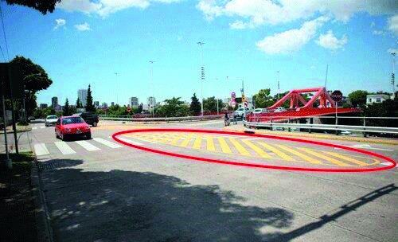

========== Question ==========  

### ¿Qué indica esta demarcación amarilla en la calzada?



A. Que es un sector destinado a la detención y al estacionamiento de vehículos.

B. Que se debe circular lentamente por su sector central.

C. Que no se debe circular sobre ella.  

========== Answer ==========  

C. Que no se debe circular sobre ella.

========== Id ==========  
327

---

DECK INFO

TARGET DECK: Licencia::Preguntas::MLDCB - Licencia de conducir buenos aires - multi author::Part I - Introduccion::Chapter 1 - Bateria de preguntas

FILE TAGS: #Licencia::#MLDCB-Licencia-de-conducir-buenos-aires-multi-author::#Part-I-Introduccion::#Chapter-1-Bateria-de-preguntas::#327-Qu-indica-esta-demarcaci-n-amarilla-en-l

Tags:

Reference:

Related:

```dataview
LIST
where file.name = this.file.name
```

QUESTION STATUS: Safe to store
