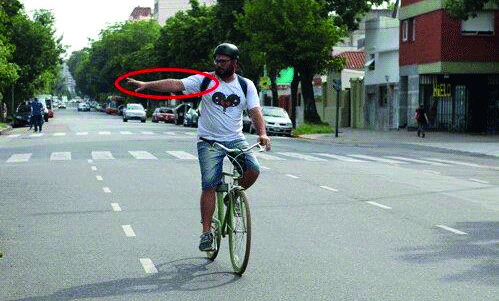

========== Question ==========  

### ¿Qué indica esta seña?



A. Adelantamiento por la derecha.

B. Giro a la derecha.

C. Detenerse.  

========== Answer ==========  

B. Giro a la derecha.

========== Id ==========  
33

---

DECK INFO

TARGET DECK: Licencia::Preguntas::MLDCB - Licencia de conducir buenos aires - multi author::Part I - Introduccion::Chapter 1 - Bateria de preguntas

FILE TAGS: #Licencia::#MLDCB-Licencia-de-conducir-buenos-aires-multi-author::#Part-I-Introduccion::#Chapter-1-Bateria-de-preguntas::#33-Qu-indica-esta-se-a-img-p10-3--ima

Tags:

Reference:

Related:

```dataview
LIST
where file.name = this.file.name
```

QUESTION STATUS: Safe to store
