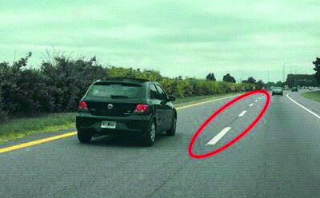

========== Question ==========  

### En la siguiente imagen, ¿qué indican las líneas centrales de la calzada señaladas?



A. Que se pueden traspasar.

B. Que está prohibido traspasarlas.

C. Que es una zona de máximo peligro.  

========== Answer ==========  

A. Que se pueden traspasar.

========== Id ==========  
330

---

DECK INFO

TARGET DECK: Licencia::Preguntas::MLDCB - Licencia de conducir buenos aires - multi author::Part I - Introduccion::Chapter 1 - Bateria de preguntas

FILE TAGS: #Licencia::#MLDCB-Licencia-de-conducir-buenos-aires-multi-author::#Part-I-Introduccion::#Chapter-1-Bateria-de-preguntas::#330-En-la-siguiente-imagen-qu-indican-las-l

Tags:

Reference:

Related:

```dataview
LIST
where file.name = this.file.name
```

QUESTION STATUS: Safe to store
