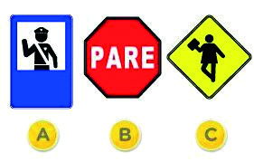

========== Question ==========  

### ¿Cuál de estas señales es Reglamentaria?



A. La señal A.

B. La señal B.

C. La señal C.  

========== Answer ==========  

B. La señal B.

========== Id ==========  
336

---

DECK INFO

TARGET DECK: Licencia::Preguntas::MLDCB - Licencia de conducir buenos aires - multi author::Part I - Introduccion::Chapter 1 - Bateria de preguntas

FILE TAGS: #Licencia::#MLDCB-Licencia-de-conducir-buenos-aires-multi-author::#Part-I-Introduccion::#Chapter-1-Bateria-de-preguntas::#336-Cu-l-de-estas-se-ales-es-reglamentaria

Tags:

Reference:

Related:

```dataview
LIST
where file.name = this.file.name
```

QUESTION STATUS: Safe to store
