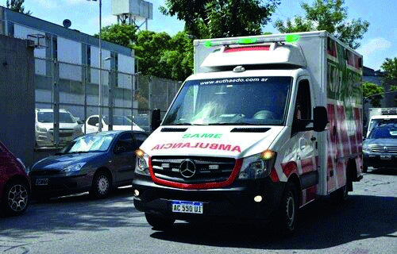

========== Question ==========  

### Frente a la siguiente situación de emergencia, ¿qué deben hacer los conductores que circulen en su proximidad?



A. Aumentar la velocidad para no ser un obstáculo a este vehículo.

B. Avisar a otros conductores de la presencia de este vehículo, usando repetidamente la bocina.

C. Dar lugar a este vehículo, despejar el carril de emergencias y si fuera necesario detenerse.  

========== Answer ==========  

C. Dar lugar a este vehículo, despejar el carril de emergencias y si fuera necesario detenerse.

========== Id ==========  
342

---

DECK INFO

TARGET DECK: Licencia::Preguntas::MLDCB - Licencia de conducir buenos aires - multi author::Part I - Introduccion::Chapter 1 - Bateria de preguntas

FILE TAGS: #Licencia::#MLDCB-Licencia-de-conducir-buenos-aires-multi-author::#Part-I-Introduccion::#Chapter-1-Bateria-de-preguntas::#342-Frente-a-la-siguiente-situaci-n-de-emergen

Tags:

Reference:

Related:

```dataview
LIST
where file.name = this.file.name
```

QUESTION STATUS: Safe to store
