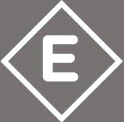

========== Question ==========  

### El siguiente símbolo indica que se trata de un carril que debe ser liberado cuando se aproxima un vehículo en emergencia.}



• Verdadero.

• Falso.  

========== Answer ==========  

Verdadero.

========== Id ==========  
343

---

DECK INFO

TARGET DECK: Licencia::Preguntas::MLDCB - Licencia de conducir buenos aires - multi author::Part I - Introduccion::Chapter 1 - Bateria de preguntas

FILE TAGS: #Licencia::#MLDCB-Licencia-de-conducir-buenos-aires-multi-author::#Part-I-Introduccion::#Chapter-1-Bateria-de-preguntas::#343-El-siguiente-s-mbolo-indica-que-se-trata-d

Tags:

Reference:

Related:

```dataview
LIST
where file.name = this.file.name
```

QUESTION STATUS: Safe to store
