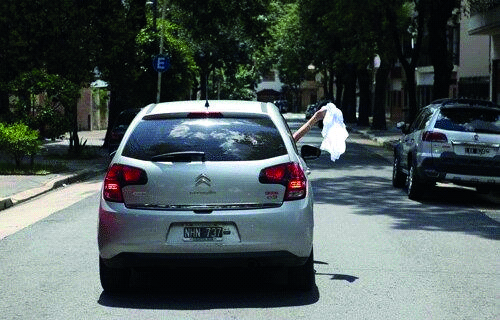

========== Question ==========  

### Ud. se encuentra frente a la siguiente situación donde el conductor toca repetidamente la bocina, ¿qué debe hacer si se encuentra conduciendo en su proximidad?



A. Cederle el paso, ya que está indicando que se encuentra en emergencia.

B. Brindar mi colaboración, ya que está indicando que el vehículo tiene un desperfecto mecánico.

C. Alertar a otros conductores, tocando repetidamente la bocina, que ese vehículo cruzará un se  

========== Answer ==========  

A. Cederle el paso, ya que está indicando que se encuentra en emergencia.

========== Id ==========  
347

---

DECK INFO

TARGET DECK: Licencia::Preguntas::MLDCB - Licencia de conducir buenos aires - multi author::Part I - Introduccion::Chapter 1 - Bateria de preguntas

FILE TAGS: #Licencia::#MLDCB-Licencia-de-conducir-buenos-aires-multi-author::#Part-I-Introduccion::#Chapter-1-Bateria-de-preguntas::#347-Ud-se-encuentra-frente-a-la-siguiente-sit

Tags:

Reference:

Related:

```dataview
LIST
where file.name = this.file.name
```

QUESTION STATUS: Safe to store
