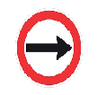

========== Question ==========  

### La siguiente señal indica:



A. Paso obligatorio

B. Giro obligatorio derecha

C. Sentido circulación (derecha)  

========== Answer ==========  

C. Sentido circulación (derecha)

========== Id ==========  
363

---

DECK INFO

TARGET DECK: Licencia::Preguntas::MLDCB - Licencia de conducir buenos aires - multi author::Part I - Introduccion::Chapter 1 - Bateria de preguntas

FILE TAGS: #Licencia::#MLDCB-Licencia-de-conducir-buenos-aires-multi-author::#Part-I-Introduccion::#Chapter-1-Bateria-de-preguntas::#363-La-siguiente-se-al-indica-img-p91-13

Tags:

Reference:

Related:

```dataview
LIST
where file.name = this.file.name
```

QUESTION STATUS: Safe to store
