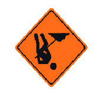

========== Question ==========  

### (Pregunta de carácter eliminatorio) 220) La siguiente señal indica:



A. Zona de montaña

B. Niños

C. Hombres trabajando  

========== Answer ==========  

C. Hombres trabajando

========== Id ==========  
383

---

DECK INFO

TARGET DECK: Licencia::Preguntas::MLDCB - Licencia de conducir buenos aires - multi author::Part I - Introduccion::Chapter 1 - Bateria de preguntas

FILE TAGS: #Licencia::#MLDCB-Licencia-de-conducir-buenos-aires-multi-author::#Part-I-Introduccion::#Chapter-1-Bateria-de-preguntas::#383-Pregunta-de-car-cter-eliminatorio-220-l

Tags:

Reference:

Related:

```dataview
LIST
where file.name = this.file.name
```

QUESTION STATUS: Safe to store
