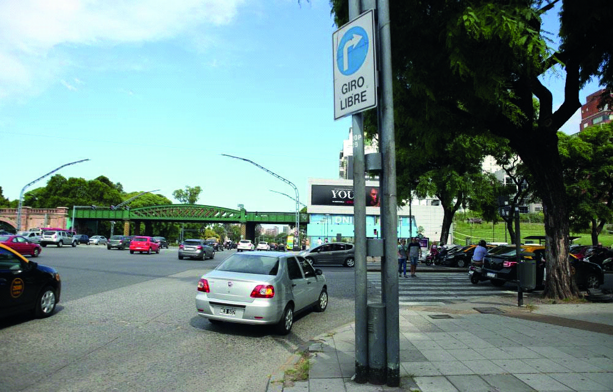

========== Question ==========  

### Dadas las características de esta intersección, ¿el peatón también tiene prioridad?



A. No, pero si el peatón se encuentra cruzando, el conductor debe dejarlo pasar para no producir un siniestro vial.

B. Sí, siempre.  

========== Answer ==========  

B. Sí, siempre.

========== Id ==========  
39

---

DECK INFO

TARGET DECK: Licencia::Preguntas::MLDCB - Licencia de conducir buenos aires - multi author::Part I - Introduccion::Chapter 1 - Bateria de preguntas

FILE TAGS: #Licencia::#MLDCB-Licencia-de-conducir-buenos-aires-multi-author::#Part-I-Introduccion::#Chapter-1-Bateria-de-preguntas::#39-Dadas-las-caracter-sticas-de-esta-intersec

Tags:

Reference:

Related:

```dataview
LIST
where file.name = this.file.name
```

QUESTION STATUS: Safe to store
