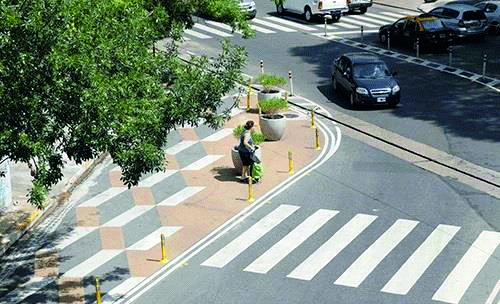

========== Question ==========  

### Frente a la siguiente situación, ¿qué actitud debe tomar usted como conductor?



A. Hacer contacto visual con la peatona y en el caso de que comience a cruzar cederle el paso.

B. Avanzar ya que se tiene prioridad sobre la peatona por circular desde la derecha.

C. Ambas respuestas, la A y la B, son incorrectas.  

========== Answer ==========  

A. Hacer contacto visual con la peatona y en el caso de que comience a cruzar cederle el paso.

========== Id ==========  
40

---

DECK INFO

TARGET DECK: Licencia::Preguntas::MLDCB - Licencia de conducir buenos aires - multi author::Part I - Introduccion::Chapter 1 - Bateria de preguntas

FILE TAGS: #Licencia::#MLDCB-Licencia-de-conducir-buenos-aires-multi-author::#Part-I-Introduccion::#Chapter-1-Bateria-de-preguntas::#40-Frente-a-la-siguiente-situaci-n-qu-acti

Tags:

Reference:

Related:

```dataview
LIST
where file.name = this.file.name
```

QUESTION STATUS: Safe to store
