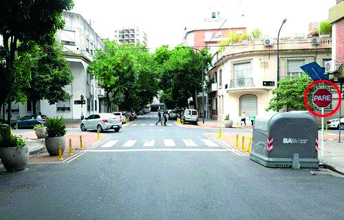

========== Question ==========  

### Al conducir un vehículo y llegar a esta intersección, ¿cómo debe proceder frente a esta señal?



A. Disminuir un poco la velocidad y mirar que no se acerquen vehículos por la vía a la que se va a incorporar.

B. Reducir la velocidad y detener el vehículo antes de la senda peatonal.

C. Avanzar.  

========== Answer ==========  

B. Reducir la velocidad y detener el vehículo antes de la senda peatonal.

========== Id ==========  
408

---

DECK INFO

TARGET DECK: Licencia::Preguntas::MLDCB - Licencia de conducir buenos aires - multi author::Part I - Introduccion::Chapter 1 - Bateria de preguntas

FILE TAGS: #Licencia::#MLDCB-Licencia-de-conducir-buenos-aires-multi-author::#Part-I-Introduccion::#Chapter-1-Bateria-de-preguntas::#408-Al-conducir-un-veh-culo-y-llegar-a-esta-in

Tags:

Reference:

Related:

```dataview
LIST
where file.name = this.file.name
```

QUESTION STATUS: Safe to store
