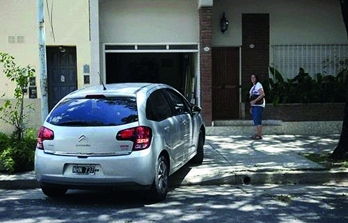

========== Question ==========  

### Si ud. es el conductor del vehículo, ¿qué conducta debe adoptar en la siguiente situación?



A. Priorizar la circulación del peatón, indefectiblemente.

B. Realizar una guiñada para advertir su preferencia de avance.

C. Completar la maniobra como sea posible, para disminuir su tiempo de permanencia sobre la vereda.  

========== Answer ==========  

A. Priorizar la circulación del peatón, indefectiblemente.

========== Id ==========  
41

---

DECK INFO

TARGET DECK: Licencia::Preguntas::MLDCB - Licencia de conducir buenos aires - multi author::Part I - Introduccion::Chapter 1 - Bateria de preguntas

FILE TAGS: #Licencia::#MLDCB-Licencia-de-conducir-buenos-aires-multi-author::#Part-I-Introduccion::#Chapter-1-Bateria-de-preguntas::#41-Si-ud-es-el-conductor-del-veh-culo-qu

Tags:

Reference:

Related:

```dataview
LIST
where file.name = this.file.name
```

QUESTION STATUS: Safe to store
