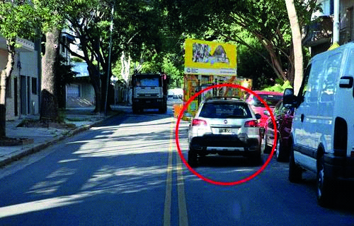

========== Question ==========  

### Frente a esta situación de obstrucción de vía, ¿qué debe hacer el conductor del vehículo señalado?



A. Debe ceder el paso al vehículo que circula en el sentido contrario.

B. Tiene prioridad de paso sobre el otro vehículo.

C. La normativa no establece prioridad de paso ante esta situación.  

========== Answer ==========  

A. Debe ceder el paso al vehículo que circula en el sentido contrario.

========== Id ==========  
413

---

DECK INFO

TARGET DECK: Licencia::Preguntas::MLDCB - Licencia de conducir buenos aires - multi author::Part I - Introduccion::Chapter 1 - Bateria de preguntas

FILE TAGS: #Licencia::#MLDCB-Licencia-de-conducir-buenos-aires-multi-author::#Part-I-Introduccion::#Chapter-1-Bateria-de-preguntas::#413-Frente-a-esta-situaci-n-de-obstrucci-n-de

Tags:

Reference:

Related:

```dataview
LIST
where file.name = this.file.name
```

QUESTION STATUS: Safe to store
