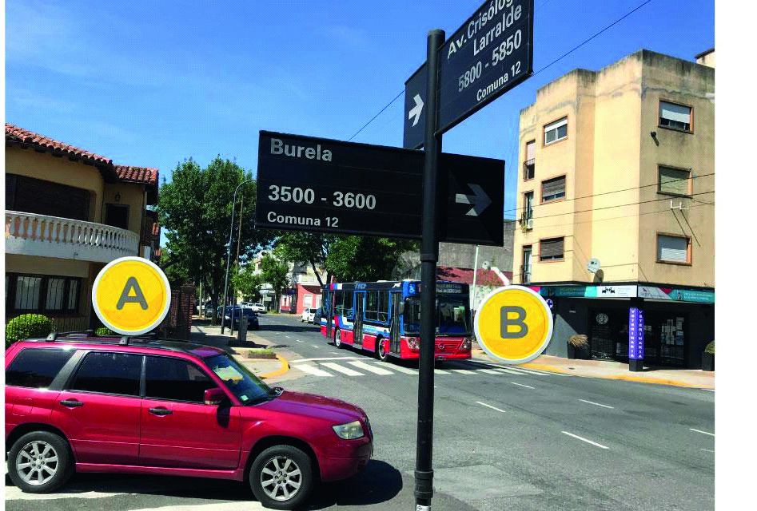

========== Question ==========  

### En la siguiente situación, ¿a quién le corresponde la prioridad de paso?



A. Al vehículo A, ya que circula por la derecha.

B. Al vehículo B, ya que circula por una avenida.

C. Es indistinto.  

========== Answer ==========  

B. Al vehículo B, ya que circula por una avenida.

========== Id ==========  
414

---

DECK INFO

TARGET DECK: Licencia::Preguntas::MLDCB - Licencia de conducir buenos aires - multi author::Part I - Introduccion::Chapter 1 - Bateria de preguntas

FILE TAGS: #Licencia::#MLDCB-Licencia-de-conducir-buenos-aires-multi-author::#Part-I-Introduccion::#Chapter-1-Bateria-de-preguntas::#414-En-la-siguiente-situaci-n-a-qui-n-le-cor

Tags:

Reference:

Related:

```dataview
LIST
where file.name = this.file.name
```

QUESTION STATUS: Safe to store
