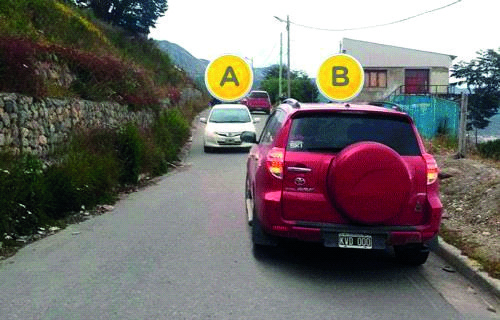

========== Question ==========  

### En esta pendiente estrecha, ¿cuál de los dos vehículos tiene prioridad de paso?



A. El vehículo A.

B. El vehículo B.  

========== Answer ==========  

B. El vehículo B.

========== Id ==========  
418

---

DECK INFO

TARGET DECK: Licencia::Preguntas::MLDCB - Licencia de conducir buenos aires - multi author::Part I - Introduccion::Chapter 1 - Bateria de preguntas

FILE TAGS: #Licencia::#MLDCB-Licencia-de-conducir-buenos-aires-multi-author::#Part-I-Introduccion::#Chapter-1-Bateria-de-preguntas::#418-En-esta-pendiente-estrecha-cu-l-de-los-d

Tags:

Reference:

Related:

```dataview
LIST
where file.name = this.file.name
```

QUESTION STATUS: Safe to store
