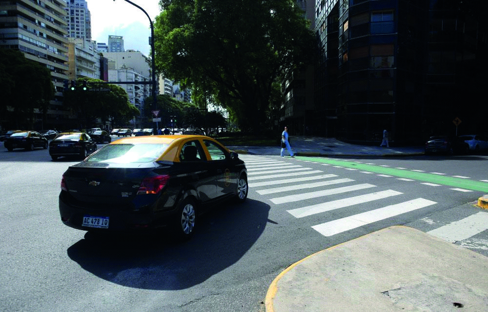

========== Question ==========  

### En esta intersección, ¿quién tiene prioridad de paso?



A. El peatón.

B. El conductor.

C. Es indistinto.  

========== Answer ==========  

A. El peatón.

========== Id ==========  
42

---

DECK INFO

TARGET DECK: Licencia::Preguntas::MLDCB - Licencia de conducir buenos aires - multi author::Part I - Introduccion::Chapter 1 - Bateria de preguntas

FILE TAGS: #Licencia::#MLDCB-Licencia-de-conducir-buenos-aires-multi-author::#Part-I-Introduccion::#Chapter-1-Bateria-de-preguntas::#42-En-esta-intersecci-n-qui-n-tiene-priorid

Tags:

Reference:

Related:

```dataview
LIST
where file.name = this.file.name
```

QUESTION STATUS: Safe to store
