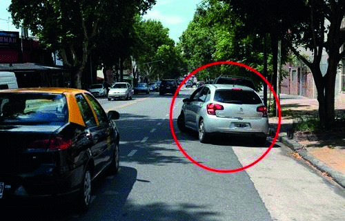

========== Question ==========  

### El vehículo señalizado quiere incorporarse al tránsito, ¿tiene prioridad de paso sobre los otros vehículos que están circulando por esta arteria?



A. No, porque los vehículos de la arteria, a la que se pretende ingresar, están circulando.

B. Sí, porque se encuentra a la derecha.

C. Sí, porque señalizó su maniobra.  

========== Answer ==========  

A. No, porque los vehículos de la arteria, a la que se pretende ingresar, están circulando.

========== Id ==========  
420

---

DECK INFO

TARGET DECK: Licencia::Preguntas::MLDCB - Licencia de conducir buenos aires - multi author::Part I - Introduccion::Chapter 1 - Bateria de preguntas

FILE TAGS: #Licencia::#MLDCB-Licencia-de-conducir-buenos-aires-multi-author::#Part-I-Introduccion::#Chapter-1-Bateria-de-preguntas::#420-El-veh-culo-se-alizado-quiere-incorporarse

Tags:

Reference:

Related:

```dataview
LIST
where file.name = this.file.name
```

QUESTION STATUS: Safe to store
