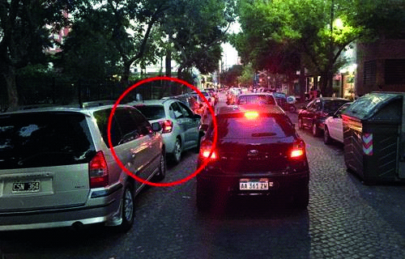

========== Question ==========  

### El vehículo señalizado quiere incorporarse al tránsito, ¿tiene prioridad de paso sobre los otros vehículos que están detenidos en la arteria?



A. No. La prioridad es de los otros vehículos, independientemente si están detenidos o circulando.

B. Sí, porque se encuentra el tránsito detenido y deben cederle el paso.

C. No. La Ley no menciona nada al respecto, sólo se expresa sobre las prioridades en intersecciones no semaforizadas.  

========== Answer ==========  

B. Sí, porque se encuentra el tránsito detenido y deben cederle el paso.

========== Id ==========  
421

---

DECK INFO

TARGET DECK: Licencia::Preguntas::MLDCB - Licencia de conducir buenos aires - multi author::Part I - Introduccion::Chapter 1 - Bateria de preguntas

FILE TAGS: #Licencia::#MLDCB-Licencia-de-conducir-buenos-aires-multi-author::#Part-I-Introduccion::#Chapter-1-Bateria-de-preguntas::#421-El-veh-culo-se-alizado-quiere-incorporarse

Tags:

Reference:

Related:

```dataview
LIST
where file.name = this.file.name
```

QUESTION STATUS: Safe to store
