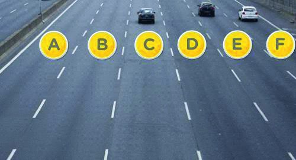

========== Question ==========  

### ¿Cuál de estos carriles es el llamado “”carril de sobrepaso””?



A. Cualquiera de ellos.

B. Sólo el carril señalado como A.

C. Sólo el carril señalado como F.  

========== Answer ==========  

B. Sólo el carril señalado como A.

========== Id ==========  
427

---

DECK INFO

TARGET DECK: Licencia::Preguntas::MLDCB - Licencia de conducir buenos aires - multi author::Part I - Introduccion::Chapter 1 - Bateria de preguntas

FILE TAGS: #Licencia::#MLDCB-Licencia-de-conducir-buenos-aires-multi-author::#Part-I-Introduccion::#Chapter-1-Bateria-de-preguntas::#427-Cu-l-de-estos-carriles-es-el-llamado-ca

Tags:

Reference:

Related:

```dataview
LIST
where file.name = this.file.name
```

QUESTION STATUS: Safe to store
