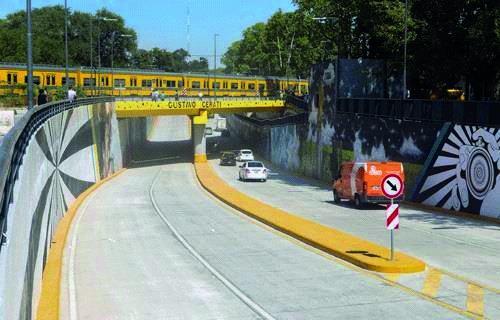

========== Question ==========  

### ¿Está permitido sobrepasar a otro vehículo en este lugar?



A. Sí, salvo que haya una señal que indique lo contrario.

B. No, está prohibido por normativa.

C. Sólo en el caso de que no perjudique la circulación de otros vehículos.  

========== Answer ==========  

B. No, está prohibido por normativa.

========== Id ==========  
432

---

DECK INFO

TARGET DECK: Licencia::Preguntas::MLDCB - Licencia de conducir buenos aires - multi author::Part I - Introduccion::Chapter 1 - Bateria de preguntas

FILE TAGS: #Licencia::#MLDCB-Licencia-de-conducir-buenos-aires-multi-author::#Part-I-Introduccion::#Chapter-1-Bateria-de-preguntas::#432-Est-permitido-sobrepasar-a-otro-veh-culo

Tags:

Reference:

Related:

```dataview
LIST
where file.name = this.file.name
```

QUESTION STATUS: Safe to store
