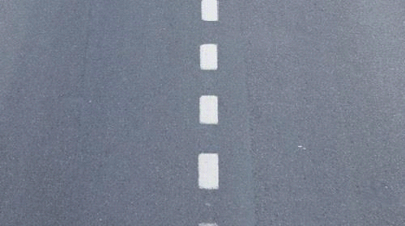

========== Question ==========  

### ¿Se puede traspasar la siguiente señal horizontal?



A. Sí, porque ordena la circulación de carriles e indica que se puede sobrepasar a otro vehículo.

B. Sólo cuando la vía tiene dos carriles por sentido de circulación.

C. No, porque indica prohibición de sobrepaso.  

========== Answer ==========  

A. Sí, porque ordena la circulación de carriles e indica que se puede sobrepasar a otro vehículo.

========== Id ==========  
436

---

DECK INFO

TARGET DECK: Licencia::Preguntas::MLDCB - Licencia de conducir buenos aires - multi author::Part I - Introduccion::Chapter 1 - Bateria de preguntas

FILE TAGS: #Licencia::#MLDCB-Licencia-de-conducir-buenos-aires-multi-author::#Part-I-Introduccion::#Chapter-1-Bateria-de-preguntas::#436-Se-puede-traspasar-la-siguiente-se-al-hor

Tags:

Reference:

Related:

```dataview
LIST
where file.name = this.file.name
```

QUESTION STATUS: Safe to store
