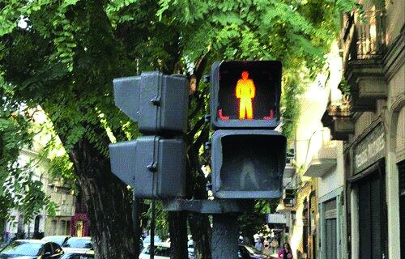

========== Question ==========  

### Como conductor, observa que esta luz se encuentra intermitente, ¿qué debería esperar que haga el peatón?



A. Que no comience a cruzar la calzada.

B. Si inició el cruce, que lo finalice con mucha precaución.

C. Ambas respuestas, la A y la B son correctas.  

========== Answer ==========  

C. Ambas respuestas, la A y la B son correctas.

========== Id ==========  
44

---

DECK INFO

TARGET DECK: Licencia::Preguntas::MLDCB - Licencia de conducir buenos aires - multi author::Part I - Introduccion::Chapter 1 - Bateria de preguntas

FILE TAGS: #Licencia::#MLDCB-Licencia-de-conducir-buenos-aires-multi-author::#Part-I-Introduccion::#Chapter-1-Bateria-de-preguntas::#44-Como-conductor-observa-que-esta-luz-se-en

Tags:

Reference:

Related:

```dataview
LIST
where file.name = this.file.name
```

QUESTION STATUS: Safe to store
