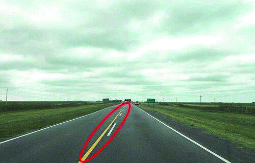

========== Question ==========  

### Frente a la demarcación central de la calzada señalada, ¿cuál es la conducta a seguir?



A. Se debe respetar lo que rige con respecto a la línea más próxima; si es continua no traspasarla y si es discontinua está permitido hacerlo.

B. Se debe respetar lo que rige con respecto a la línea más próxima; si es discontinua no traspasarla y si es continua está permitido hacerlo.

C. No debe traspasarse ninguna de ellas.  

========== Answer ==========  

A. Se debe respetar lo que rige con respecto a la línea más próxima; si es continua no traspasarla y si es discontinua está permitido hacerlo.

========== Id ==========  
441

---

DECK INFO

TARGET DECK: Licencia::Preguntas::MLDCB - Licencia de conducir buenos aires - multi author::Part I - Introduccion::Chapter 1 - Bateria de preguntas

FILE TAGS: #Licencia::#MLDCB-Licencia-de-conducir-buenos-aires-multi-author::#Part-I-Introduccion::#Chapter-1-Bateria-de-preguntas::#441-Frente-a-la-demarcaci-n-central-de-la-calz

Tags:

Reference:

Related:

```dataview
LIST
where file.name = this.file.name
```

QUESTION STATUS: Safe to store
