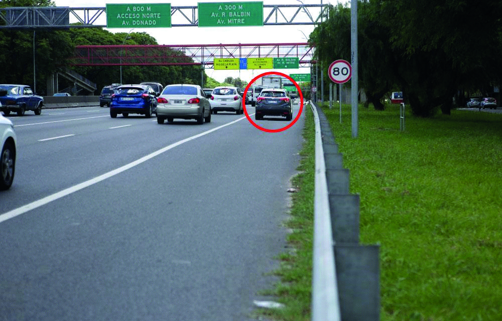

========== Question ==========  

### El vehículo señalado con un círculo rojo, ¿circula correctamente?



A. Sí, porque en esta vía las luces deben estar encendidas.

B. Sí, ya que mantiene una distancia prudencial respecto del resto de los vehículos.

C. No, dado que está circulando por la banquina.  

========== Answer ==========  

C. No, dado que está circulando por la banquina.

========== Id ==========  
445

---

DECK INFO

TARGET DECK: Licencia::Preguntas::MLDCB - Licencia de conducir buenos aires - multi author::Part I - Introduccion::Chapter 1 - Bateria de preguntas

FILE TAGS: #Licencia::#MLDCB-Licencia-de-conducir-buenos-aires-multi-author::#Part-I-Introduccion::#Chapter-1-Bateria-de-preguntas::#445-El-veh-culo-se-alado-con-un-c-rculo-rojo

Tags:

Reference:

Related:

```dataview
LIST
where file.name = this.file.name
```

QUESTION STATUS: Safe to store
