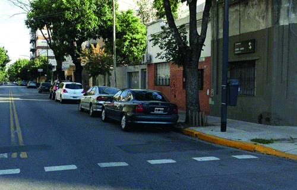

========== Question ==========  

### Según las normas generales, ¿cuál es la velocidad mínima permitida en esta calle?



A. 30 km/h.

B. 40 km/h.

C. 20 km/h.  

========== Answer ==========  

C. 20 km/h.

========== Id ==========  
449

---

DECK INFO

TARGET DECK: Licencia::Preguntas::MLDCB - Licencia de conducir buenos aires - multi author::Part I - Introduccion::Chapter 1 - Bateria de preguntas

FILE TAGS: #Licencia::#MLDCB-Licencia-de-conducir-buenos-aires-multi-author::#Part-I-Introduccion::#Chapter-1-Bateria-de-preguntas::#449-Seg-n-las-normas-generales-cu-l-es-la-ve

Tags:

Reference:

Related:

```dataview
LIST
where file.name = this.file.name
```

QUESTION STATUS: Safe to store
