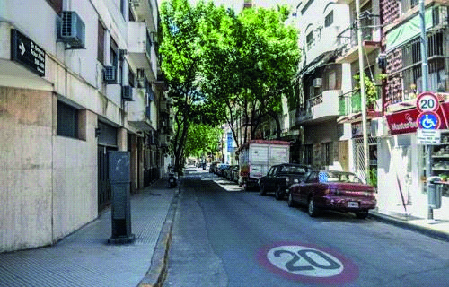

========== Question ==========  

### ¿Cuál es la velocidad máxima permitida en este tramo de calle?



A. 40 km/h.

B. 20 km/h.

C. 30 km/h.  

========== Answer ==========  

B. 20 km/h.

========== Id ==========  
453

---

DECK INFO

TARGET DECK: Licencia::Preguntas::MLDCB - Licencia de conducir buenos aires - multi author::Part I - Introduccion::Chapter 1 - Bateria de preguntas

FILE TAGS: #Licencia::#MLDCB-Licencia-de-conducir-buenos-aires-multi-author::#Part-I-Introduccion::#Chapter-1-Bateria-de-preguntas::#453-Cu-l-es-la-velocidad-m-xima-permitida-en

Tags:

Reference:

Related:

```dataview
LIST
where file.name = this.file.name
```

QUESTION STATUS: Safe to store
