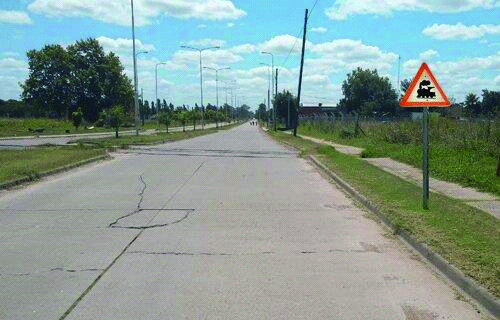

========== Question ==========  

### Si al circular en ruta se encuentra con esta señal, ¿qué conducta debe seguir?



A. Se debe disminuir la velocidad y prestar atención a la posible aproximación de trenes.

B. Se continúa con la misma velocidad, salvo que se haga efectiva la aproximación del tren.

C. Se indica al resto de los conductores, la precaución sobre la aproximación de trenes, colocando balizas.  

========== Answer ==========  

A. Se debe disminuir la velocidad y prestar atención a la posible aproximación de trenes.

========== Id ==========  
470

---

DECK INFO

TARGET DECK: Licencia::Preguntas::MLDCB - Licencia de conducir buenos aires - multi author::Part I - Introduccion::Chapter 1 - Bateria de preguntas

FILE TAGS: #Licencia::#MLDCB-Licencia-de-conducir-buenos-aires-multi-author::#Part-I-Introduccion::#Chapter-1-Bateria-de-preguntas::#470-Si-al-circular-en-ruta-se-encuentra-con-es

Tags:

Reference:

Related:

```dataview
LIST
where file.name = this.file.name
```

QUESTION STATUS: Safe to store
