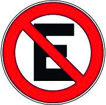

========== Question ==========  

### Como norma general, frente a esta señal, ¿está permitido detenerse para el ascenso o descenso de pasajeros?



A. No. Está prohibido estacionar y detenerse.

B. Sí. Sólo está prohibido estacionar pero no detenerse.

C. Según la hora en que quiera realizarse la detención.  

========== Answer ==========  

B. Sí. Sólo está prohibido estacionar pero no detenerse.

========== Id ==========  
475

---

DECK INFO

TARGET DECK: Licencia::Preguntas::MLDCB - Licencia de conducir buenos aires - multi author::Part I - Introduccion::Chapter 1 - Bateria de preguntas

FILE TAGS: #Licencia::#MLDCB-Licencia-de-conducir-buenos-aires-multi-author::#Part-I-Introduccion::#Chapter-1-Bateria-de-preguntas::#475-Como-norma-general-frente-a-esta-se-al

Tags:

Reference:

Related:

```dataview
LIST
where file.name = this.file.name
```

QUESTION STATUS: Safe to store
