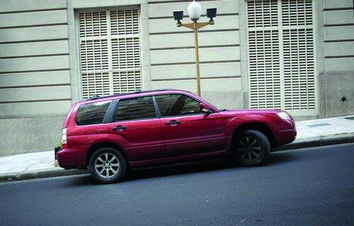

========== Question ==========  

### ¿Qué precauciones se deben tener al dejar estacionado un vehículo en esta situación?



A. Orientar las ruedas hacia el cordón de la vereda y dejar la marcha hacia atrás o en posición de estacionamiento en el caso de tener caja automática.

B. Orientar las ruedas hacia el centro de la calzada y dejar la marcha en primera o en posición de estacionamiento en el caso de tener caja automática.

C. Orientar las ruedas paralelas al cordón y sin cambio o en posición de estacionamiento en el caso de tener caja automática.  

========== Answer ==========  

B. Orientar las ruedas hacia el centro de la calzada y dejar la marcha en primera o en posición de estacionamiento en el caso de tener caja automática.

========== Id ==========  
479

---

DECK INFO

TARGET DECK: Licencia::Preguntas::MLDCB - Licencia de conducir buenos aires - multi author::Part I - Introduccion::Chapter 1 - Bateria de preguntas

FILE TAGS: #Licencia::#MLDCB-Licencia-de-conducir-buenos-aires-multi-author::#Part-I-Introduccion::#Chapter-1-Bateria-de-preguntas::#479-Qu-precauciones-se-deben-tener-al-dejar

Tags:

Reference:

Related:

```dataview
LIST
where file.name = this.file.name
```

QUESTION STATUS: Safe to store
