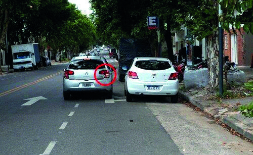

========== Question ==========  

### Si el vehículo de la imagen se dispone a ingresar a un garaje ubicado a su derecha, está anticipando su maniobra utilizando las luces correctas.



• Verdadero.

• Falso.  

========== Answer ==========  

Falso.

========== Id ==========  
487

---

DECK INFO

TARGET DECK: Licencia::Preguntas::MLDCB - Licencia de conducir buenos aires - multi author::Part I - Introduccion::Chapter 1 - Bateria de preguntas

FILE TAGS: #Licencia::#MLDCB-Licencia-de-conducir-buenos-aires-multi-author::#Part-I-Introduccion::#Chapter-1-Bateria-de-preguntas::#487-Si-el-veh-culo-de-la-imagen-se-dispone-a-i

Tags:

Reference:

Related:

```dataview
LIST
where file.name = this.file.name
```

QUESTION STATUS: Safe to store
