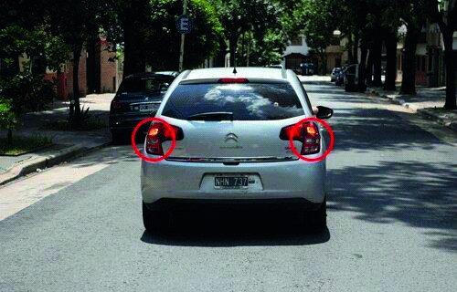

========== Question ==========  

### Al observar las luces de este vehículo, ¿qué significado tienen en cuanto al sentido de circulación?



A. Que está circulando en mí mismo sentido.

B. Que está circulando en el sentido contrario al mío.

C. No indican sentido de circulación sino que está descompuesto.  

========== Answer ==========  

A. Que está circulando en mí mismo sentido.

========== Id ==========  
494

---

DECK INFO

TARGET DECK: Licencia::Preguntas::MLDCB - Licencia de conducir buenos aires - multi author::Part I - Introduccion::Chapter 1 - Bateria de preguntas

FILE TAGS: #Licencia::#MLDCB-Licencia-de-conducir-buenos-aires-multi-author::#Part-I-Introduccion::#Chapter-1-Bateria-de-preguntas::#494-Al-observar-las-luces-de-este-veh-culo-q

Tags:

Reference:

Related:

```dataview
LIST
where file.name = this.file.name
```

QUESTION STATUS: Safe to store
