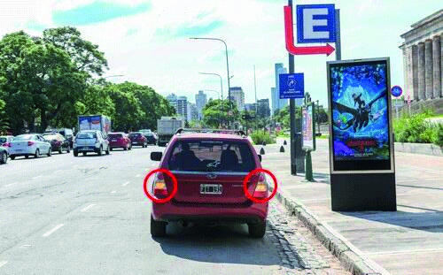

========== Question ==========  

### ¿Para qué sirven estas luces intermitentes?



A. Para advertir a los demás conductores, frente a malas condiciones climáticas, que el vehículo circula a baja velocidad.

B. Para señalizar y advertir a los demás conductores que el vehículo se encuentra detenido o próximo a una maniobra de detención, estacionamiento o emergencia.

C. Ambas respuestas, A y B, son correctas.  

========== Answer ==========  

B. Para señalizar y advertir a los demás conductores que el vehículo se encuentra detenido o próximo a una maniobra de detención, estacionamiento o emergencia.

========== Id ==========  
495

---

DECK INFO

TARGET DECK: Licencia::Preguntas::MLDCB - Licencia de conducir buenos aires - multi author::Part I - Introduccion::Chapter 1 - Bateria de preguntas

FILE TAGS: #Licencia::#MLDCB-Licencia-de-conducir-buenos-aires-multi-author::#Part-I-Introduccion::#Chapter-1-Bateria-de-preguntas::#495-Para-qu-sirven-estas-luces-intermitentes

Tags:

Reference:

Related:

```dataview
LIST
where file.name = this.file.name
```

QUESTION STATUS: Safe to store
