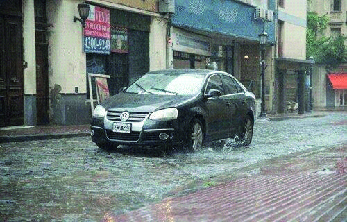

========== Question ==========  

### En cuanto a la velocidad frente a esta situación, ¿qué debería considerar un conductor?



A. Debería circular a la mitad de la velocidad máxima establecida por Ley.

B. Debería adecuar la velocidad de acuerdo a las condiciones climáticas y de dicha vía de circulación.

C. Lo único que debería hacer es respetar es la velocidad máxima de la arteria por la que circula.  

========== Answer ==========  

B. Debería adecuar la velocidad de acuerdo a las condiciones climáticas y de dicha vía de circulación.

========== Id ==========  
501

---

DECK INFO

TARGET DECK: Licencia::Preguntas::MLDCB - Licencia de conducir buenos aires - multi author::Part I - Introduccion::Chapter 1 - Bateria de preguntas

FILE TAGS: #Licencia::#MLDCB-Licencia-de-conducir-buenos-aires-multi-author::#Part-I-Introduccion::#Chapter-1-Bateria-de-preguntas::#501-En-cuanto-a-la-velocidad-frente-a-esta-sit

Tags:

Reference:

Related:

```dataview
LIST
where file.name = this.file.name
```

QUESTION STATUS: Safe to store
