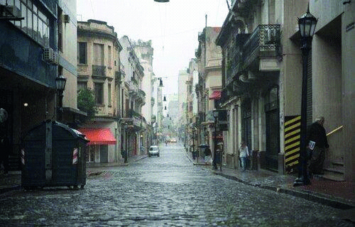

========== Question ==========  

### Frente a esta condición climática, ¿se deben encender las luces bajas?



A. Sí, siempre que está disminuida la visibilidad.

B. No, porque las luces sólo deben utilizarse por la noche.

C. Sí, pero sólo en rutas.  

========== Answer ==========  

A. Sí, siempre que está disminuida la visibilidad.

========== Id ==========  
505

---

DECK INFO

TARGET DECK: Licencia::Preguntas::MLDCB - Licencia de conducir buenos aires - multi author::Part I - Introduccion::Chapter 1 - Bateria de preguntas

FILE TAGS: #Licencia::#MLDCB-Licencia-de-conducir-buenos-aires-multi-author::#Part-I-Introduccion::#Chapter-1-Bateria-de-preguntas::#505-Frente-a-esta-condici-n-clim-tica-se-deb

Tags:

Reference:

Related:

```dataview
LIST
where file.name = this.file.name
```

QUESTION STATUS: Safe to store
