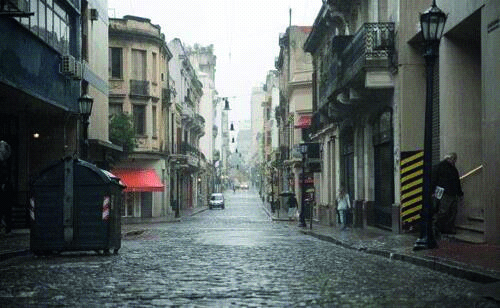

========== Question ==========  

### Bajo esta condición climática, ¿es recomendable aumentar la distancia de seguridad y reducir la velocidad?



A. No, al reducir la velocidad, mayor es la proporción de agua en el asfalto.

B. Sí, con lluvia la adherencia es menor.

C. No. La distancia de seguridad debe ser siempre la misma.  

========== Answer ==========  

B. Sí, con lluvia la adherencia es menor.

========== Id ==========  
507

---

DECK INFO

TARGET DECK: Licencia::Preguntas::MLDCB - Licencia de conducir buenos aires - multi author::Part I - Introduccion::Chapter 1 - Bateria de preguntas

FILE TAGS: #Licencia::#MLDCB-Licencia-de-conducir-buenos-aires-multi-author::#Part-I-Introduccion::#Chapter-1-Bateria-de-preguntas::#507-Bajo-esta-condici-n-clim-tica-es-recomen

Tags:

Reference:

Related:

```dataview
LIST
where file.name = this.file.name
```

QUESTION STATUS: Safe to store
