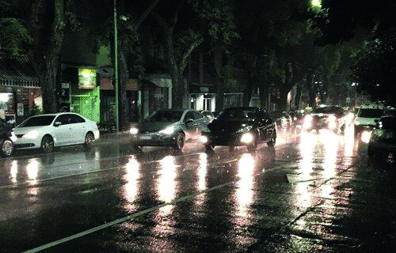

========== Question ==========  

### Cuando conduce bajo esta condición climática, ¿a cuánto se debe incrementar la regla de 2 segundos en la distancia de seguridad?



A. A 4 segundos.

B. A 3 segundos.

C. A 5 segundos.  

========== Answer ==========  

A. A 4 segundos.

========== Id ==========  
509

---

DECK INFO

TARGET DECK: Licencia::Preguntas::MLDCB - Licencia de conducir buenos aires - multi author::Part I - Introduccion::Chapter 1 - Bateria de preguntas

FILE TAGS: #Licencia::#MLDCB-Licencia-de-conducir-buenos-aires-multi-author::#Part-I-Introduccion::#Chapter-1-Bateria-de-preguntas::#509-Cuando-conduce-bajo-esta-condici-n-clim-ti

Tags:

Reference:

Related:

```dataview
LIST
where file.name = this.file.name
```

QUESTION STATUS: Safe to store
