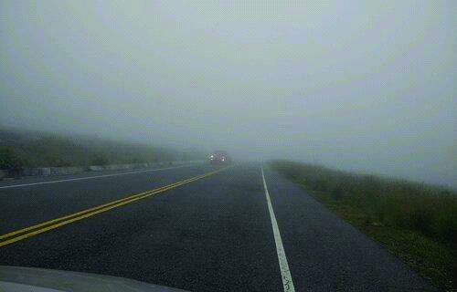

========== Question ==========  

### Si se encuentra en esta vía bajo estas condiciones climáticas, ¿lo más conveniente es detenerse en la banquina?



A. Sí, cuando el banco de niebla es muy denso.

B. Sí, siempre y cuando se coloquen las luces altas para ser más visibles.

C. No. Si no hay posibilidad de circular, debe alejarse lo más posible de la calzada y de la banquina.  

========== Answer ==========  

C. No. Si no hay posibilidad de circular, debe alejarse lo más posible de la calzada y de la banquina.

========== Id ==========  
516

---

DECK INFO

TARGET DECK: Licencia::Preguntas::MLDCB - Licencia de conducir buenos aires - multi author::Part I - Introduccion::Chapter 1 - Bateria de preguntas

FILE TAGS: #Licencia::#MLDCB-Licencia-de-conducir-buenos-aires-multi-author::#Part-I-Introduccion::#Chapter-1-Bateria-de-preguntas::#516-Si-se-encuentra-en-esta-v-a-bajo-estas-con

Tags:

Reference:

Related:

```dataview
LIST
where file.name = this.file.name
```

QUESTION STATUS: Safe to store
