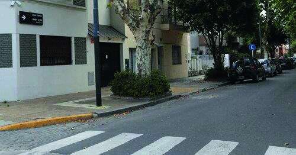

========== Question ==========  

### En caso de un siniestro vial en este tipo de calle, ¿cómo es recomendable señalizar la zona del vehículo inmovilizado?



A. Se deben encender las luces bajas y, en lo posible, colocar balizas portátiles delante y detrás del mismo.

B. Se deben encender las luces altas y, en lo posible, colocar balizas portátiles detrás del mismo.

C. Se deben encender las balizas y, en lo posible, colocar balizas portátiles del lado de don- de provienen los vehículos a una distancia adecuada del vehículo.  

========== Answer ==========  

C. Se deben encender las balizas y, en lo posible, colocar balizas portátiles del lado de don- de provienen los vehículos a una distancia adecuada del vehículo.

========== Id ==========  
53

---

DECK INFO

TARGET DECK: Licencia::Preguntas::MLDCB - Licencia de conducir buenos aires - multi author::Part I - Introduccion::Chapter 1 - Bateria de preguntas

FILE TAGS: #Licencia::#MLDCB-Licencia-de-conducir-buenos-aires-multi-author::#Part-I-Introduccion::#Chapter-1-Bateria-de-preguntas::#53-En-caso-de-un-siniestro-vial-en-este-tipo

Tags:

Reference:

Related:

```dataview
LIST
where file.name = this.file.name
```

QUESTION STATUS: Safe to store
