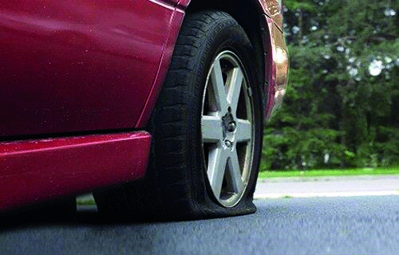

========== Question ==========  

### Si al circular se presenta la siguiente situación, ¿cuál es la acción que se recomienda realizar?



A. Frenar inmediatamente.

B. Desacelerar rápidamente y frenar.

C. Desacelerar lentamente y sujetar el volante.  

========== Answer ==========  

C. Desacelerar lentamente y sujetar el volante.

========== Id ==========  
546

---

DECK INFO

TARGET DECK: Licencia::Preguntas::MLDCB - Licencia de conducir buenos aires - multi author::Part I - Introduccion::Chapter 1 - Bateria de preguntas

FILE TAGS: #Licencia::#MLDCB-Licencia-de-conducir-buenos-aires-multi-author::#Part-I-Introduccion::#Chapter-1-Bateria-de-preguntas::#546-Si-al-circular-se-presenta-la-siguiente-si

Tags:

Reference:

Related:

```dataview
LIST
where file.name = this.file.name
```

QUESTION STATUS: Safe to store
