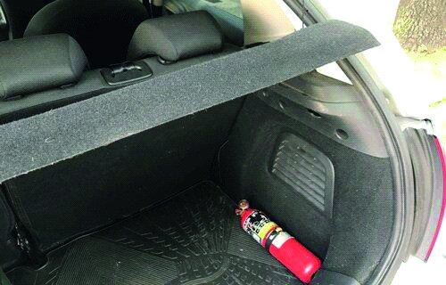

========== Question ==========  

### El siguiente elemento de seguridad, está correctamente ubicado.



• Verdadero.

• Falso.  

========== Answer ==========  

Falso.

========== Id ==========  
549

---

DECK INFO

TARGET DECK: Licencia::Preguntas::MLDCB - Licencia de conducir buenos aires - multi author::Part I - Introduccion::Chapter 1 - Bateria de preguntas

FILE TAGS: #Licencia::#MLDCB-Licencia-de-conducir-buenos-aires-multi-author::#Part-I-Introduccion::#Chapter-1-Bateria-de-preguntas::#549-El-siguiente-elemento-de-seguridad-est-c

Tags:

Reference:

Related:

```dataview
LIST
where file.name = this.file.name
```

QUESTION STATUS: Safe to store
